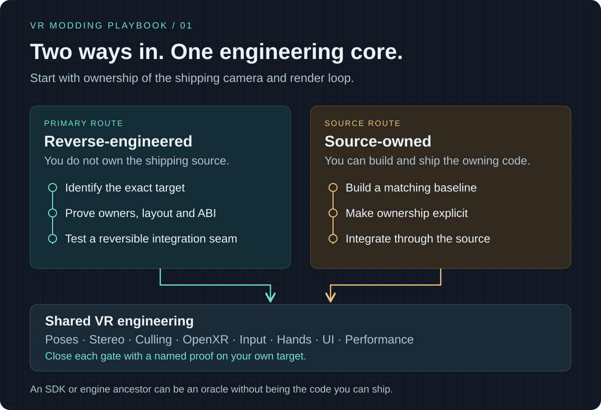
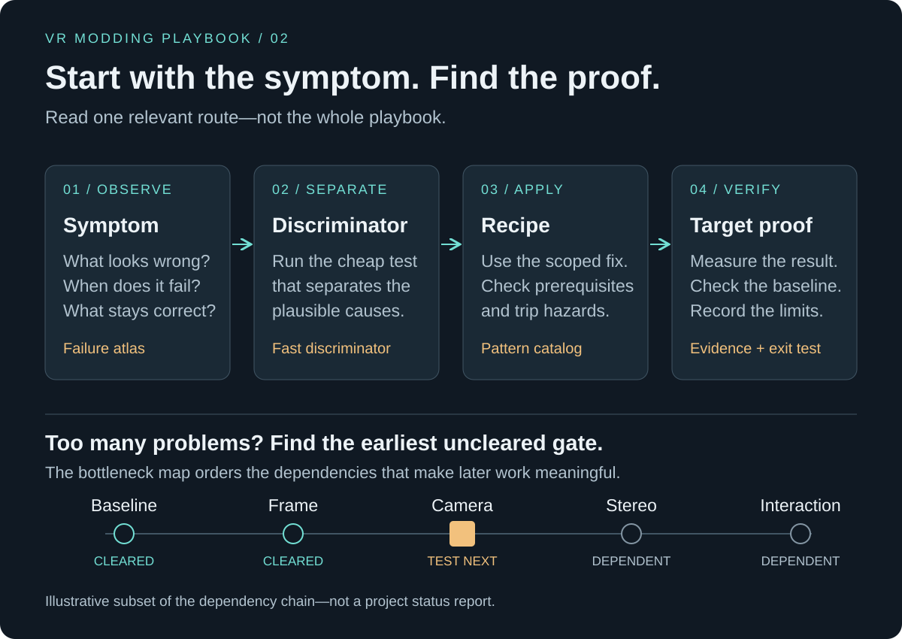
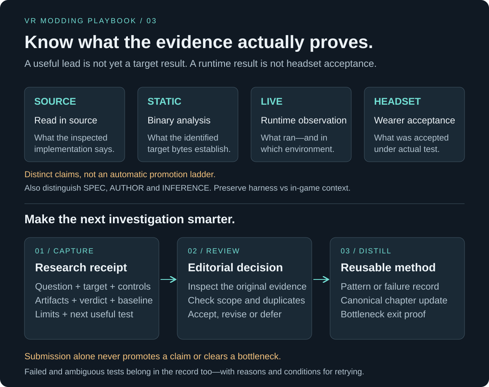

# The playbook at a glance

Three maps for using the reference. These illustrations describe the public
workflow; they are not project implementation diagrams or status dashboards.

## Choose the right integration route

**Reverse-engineered:** identify the exact target, prove ownership and ABI, then
test a reversible seam. **Source-owned:** build a matching baseline and integrate
through the owning source. Both need coherent VR systems and target-specific proof.
An SDK or source ancestor is not automatically the shipping implementation.

[Start a port](start-new-port.md) · [RE route](reverse-engineered-route.md) ·
[Source route](source-owned-route.md) · [Shared core](shared-vr-spine.md)

## Turn a symptom into a useful next test

Start with what you observe, run a cheap test that separates plausible causes,
then follow a scoped recipe and verify the result. If several problems compete,
the bottleneck map identifies the earliest uncleared dependency. The illustrated
statuses are hypothetical, and the short chain is not the complete port workflow.

[Failure atlas](failure-atlas.md) · [Patterns](pattern-catalog.md) ·
[Bottleneck map](bottleneck-map.md)

## Preserve evidence, then share the method

Source inspection, binary analysis, runtime observation and headset acceptance
answer different questions. A source or static finding need not become a live
experiment to be useful. Keep specification facts, author reports and inference
distinct too. Record validity, verdict, baseline health and environment separately.

Capture the finding or failure with artifacts and limits; submit it for review;
then update the canonical record. Submission is not automatic acceptance. Keep
raw project evidence with its owner and share only material approved for publication.

[Evidence vocabulary](start-new-port.md#the-evidence-vocabulary) ·
[Research receipts](research-receipts.md)
